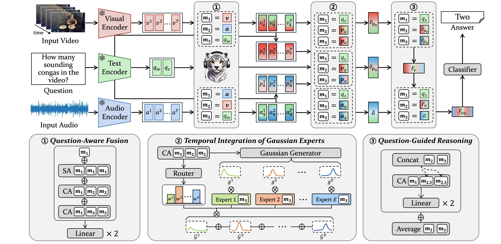

# Question-Aware Gaussian Experts for Audio-Visual Question Answering (CVPR 2025)
Official repository for "Question-Aware Gaussian Experts for Audio-Visual Question Answering" in CVPR 2025.

### [Paper]() | [arXiv](https://arxiv.org/abs/2503.04459) | [Project Page](https://aim-skku.github.io/QA-TIGER/)

> Authors: [Hongyeob Kim<sup>1*](https://github.com/redleaf-kim), [Inyoung Jung<sup>1*](https://github.com/nanacoco419), [Dayoon Suh<sup>2</sup>](https://github.com/dayoonsuh), [Sangmin Lee<sup>1](https://sites.google.com/view/sangmin-lee/home), [Sungeun Hong<sup>1</sup>&dagger;](https://www.csehong.com/) <br>
> <sup>1</sup>[Sungkyunkwan University](https://www.skku.edu/eng/index.do), <sup>2</sup>[Purdue University](https://www.purdue.edu/)

<p align=center></p>

### Abstract
>Audio-Visual Question Answering (AVQA) requires not only question-based multimodal reasoning but also precise temporal grounding to capture subtle dynamics for accurate prediction. However, existing methods mainly use question information implicitly, limiting focus on question-specific details. Furthermore, most studies rely on uniform frame sampling, which can miss key question-relevant frames. Although recent Top-K frame selection methods aim to address this, their discrete nature still overlooks fine-grained temporal details. This paper proposes QA-TIGER, a novel framework that explicitly incorporates question information and models continuous temporal dynamics. Our key idea is to use Gaussian-based modeling to adaptively focus on both consecutive and non-consecutive frames based on the question, while explicitly injecting question information and applying progressive refinement. We leverage a Mixture of Experts (MoE) to flexibly implement multiple Gaussian models, activating temporal experts specifically tailored to the question. Extensive experiments on multiple AVQA benchmarks show that QA-TIGER consistently achieves state-of-the-art performance.


### Requirements
```python
python3.10 +
pytorch2.4.0
```

## Usage

1. **Clone this repo**

    ```bash
    git clone https://github.com/AIM-SKKU/QA-TIGER.git
    ```

2. **Setting the environment**
    - with conda
    ```
    conda create -n qa-tiger python=3.10
    conda activate qa-tiger
    pip install -e .
    ```

    - with pip
    ```
    pip install -e .
    ```

2. **Prepare data**
    - you can find annotations in [`./data/annots/`](./data/annots/).
    - `notice`: for MUSIC-AVQA-v2.0, we asked the authors about the original split and pre-divided the dataset accordingly.
    - Additionally, the following links provide access to download the original annotation and data
    - MUSIC-AVQA: https://gewu-lab.github.io/MUSIC-AVQA/
    - MUSIC-AVQA-R: https://github.com/reml-group/MUSIC-AVQA-R
    - MUSIV-AVQA-v2.0: https://github.com/DragonLiu1995/MUSIC-AVQA-v2.0

4. **Feature extraction**
    - we follow the same protocol as TSPM for feature extraction. Please refer to [TSPM](https://github.com/GeWu-Lab/TSPM)
    - put the extracted features under [`./data/feats/`](./data/feats/)
    
        ```
        data
        ┣ annots
        ┃ ┣ music_avqa
        ┃ ┣ music_avqa_r
        ┃ ┣ music_avqa_v2
        ┣ feats
        ┃ ┣ frame_ViT-L14@336px
        ┃ ┣ visual_tome14
        ┃ ┣ ...
        ┗ ┗ vggish
        ```

4. **Training**

    ```shell
    bash scripts/train.sh <CONFIG> <GPU_IDX>
    ```

5. Testing

    ```shell
    bash scripts/test.sh <CONFIG> <GPU_IDX> <WEIGHT> <OUTPUT_LOG_PATH>
    ```

### Checkpoints

- will be uploaded soon


### Citation

If you find this work useful, please consider citing it.

```
coming soon!
```

### Acknowledgement
We acknowledge the following code, which served as a reference for our implementation.
- https://github.com/GeWu-Lab/TSPM
- https://github.com/GeWu-Lab/MUSIC-AVQA
